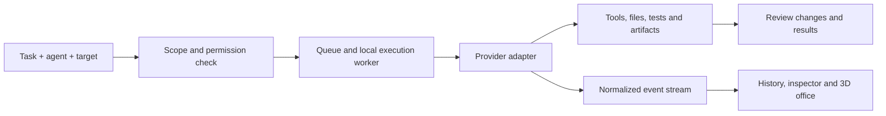

# Agent Space: product roadmap and product strategy

Research date: 9 September 2026. Expanded edition. Planning only; no application changes are included in this document. All additions below are proposed capabilities, not shipped functionality or promises of universal provider support.

**Reading guide:** Sections 1–6 establish the execution foundation. Sections 7–12 cover differentiation, providers, operating systems, orchestration, administration, and collaboration. Sections 13–18 cover visual design, domain workflows, analytics, ecosystem, marketing, and release gates. Section 19 defines the immediate next step.

**Priority key:** Foundation = required before managed execution; Launch = required for the first public product; Growth = expand after repeat usage is demonstrated; Enterprise = organization-scale controls; Explore = experiments that need demand or feasibility evidence. These labels describe dependencies, not implementation dates.

> **Implementation review, 10 September 2026:** This roadmap is not a completion checklist. The original foundation paragraph below describes the initial MVP and is now historical. Persistence, execution adapters, observation and workflows have since been added. The latest UI pass adds scene-level provider and role filtering, a recorded activity ribbon, real-workspace motion, accessible agent actions, editable agent identity/appearance, eight saved environment palettes, safe workspace-specific visual-preset preview/import/export, and a live signal bridge that distinguishes detected products from observable and active provider sessions. Google Antigravity is now shown as its own detected IDE surface when present; it is not falsely presented as Gemini CLI or as a live agent. See [the UI review](../docs/UI_UX_REVIEW.md) for changes and remaining gaps, and [the detailed status audit](../docs/ROADMAP_STATUS.md) for item-level evidence.

> **Production-default update:** Normal startup no longer seeds or selects the simulated office. Real observed workspaces take priority automatically. A passive, cross-OS surface catalog discovers Antigravity, OpenCode, Aider, and Windsurf installations in addition to the verified runtime registry, while keeping launch and event controls disabled until a tested adapter exists. The persistent provider pulse keeps local runtime health visible across every product page.

> **Living-provider update:** The Three.js office renders detected assistant surfaces as provider beacons with a responsive accessible dock. Active recorded runs draw an animated spatial link from the provider beacon to the working agent. Detection-only surfaces remain visibly inactive and cannot create agents or imply work.

> **Office hierarchy update, 11 September 2026:** The office now uses progressive disclosure to keep the live floor legible. Agent details open below the 3D scene after selection; filters, environments, rooms and minimap are deliberate controls; inactive provider surfaces and duplicate activity ribbons no longer cover the scene. The Agents route uses illustrated bot profiles that visually correspond to office participants while retaining text, provider and activity evidence.

> **Workspace density update, 11 September 2026:** The live office fills the available workspace width until an agent is selected. Selection places the evidence panel below the scene. The embedded roster is a compact bot strip; the dedicated Agents route is a full-width directory without a duplicate inspector/activity rail. Scene actions are consolidated in the camera toolbar, recent build notices are capped, and verbose event text no longer obscures the 3D floor.

> **Responsive activity update, 11 September 2026:** Workspace Activity and Agent Spotlight / Run Inspector now adapt their information layout rather than clipping it. Activity uses natural-height, progressively loaded records; inspector tabs form a responsive grid; event text keeps normal word boundaries; and tool totals become labeled cards on narrow screens. Provider provenance remains attached to each real record.

> **UI/UX architecture update, 11 September 2026:** The shell and Workspace were rebuilt around the product's central question — who is working on what, and what needs my decision. Navigation is grouped by task, the Task board and Board are one page, the office is the first thing on the Workspace, provider states say exactly what detection proves, and tokens now come from one file with a 12 px type floor. See [the UI review](../docs/UI_UX_REVIEW.md) for the page-by-page audit board and evidence.

## Current implementation board — 11 September 2026

This board is the working tracker for this roadmap. It separates shipped product behavior from work still in progress and from items that cannot be started honestly from this local repository alone.

| Slice                             | Status      | What is included                                                                                                                                                                                                                                                                                                                                                                                                                 | What remains                                                                                                                                         |
| --------------------------------- | ----------- | -------------------------------------------------------------------------------------------------------------------------------------------------------------------------------------------------------------------------------------------------------------------------------------------------------------------------------------------------------------------------------------------------------------------------------- | ---------------------------------------------------------------------------------------------------------------------------------------------------- |
| A. Adaptive product shell         | Completed   | Task-grouped navigation (Operate, Observe, Plan, System) as a labelled sidebar, icon rail or labelled phone bar with a More sheet; one Task board with List/Board layouts; factual page headers; one global New task; honest provider pulse; skip link; the 3D office fills the first screen of the Workspace at every size                                                                                                      | Periodic route screenshots as pages change                                                                                                           |
| B. Visual system overhaul         | Working on  | One token source (`web/styles/tokens.css`) with light, dark and high-contrast values; AA status colours; 12 px type floor and six-step scale; sentence-case labels; explicit stylesheet order; Tailwind removed; route audit of 16 routes × 8 viewports with no overflow, no page errors, no unnamed controls and no text under 12 px                                                                                            | About 250 legacy literal colours in `styles.css`/`office.css`, dark office overlays, durable image baselines                                         |
| C. Living 3D office               | Working on  | Event-driven avatars, live-only presence, provider beacons and insignia, active run and handoff links, camera director, evidence-based data props, workflow-linked Data Lab, eight-choice environment composer, interactive multi-workspace Campus, adaptive graphics, WebGL recovery with an in-place fallback, working minimap, fullscreen context menu, screen-reader descriptions and a dashed outline for inferred activity | Phone camera framing, handoff card time window, manual-agent activity wording, custom furniture/room editing, richer avatar meshes, real-GPU budgets |
| D. Provider adapters              | Working on  | Claude Code and Copilot paths verified here, Codex parser/app-server spike tested against fakes, provider capability matrix, detection-only Antigravity/OpenCode/Aider/Windsurf surfaces, bounded snippet artifacts                                                                                                                                                                                                              | Authenticated Codex run blocked by usage quota; Gemini auth unavailable; Cursor headless agent missing; Antigravity event bridge not yet verified    |
| E. Cross-platform runtime         | Not started | Passive cross-OS discovery paths exist for several assistant surfaces                                                                                                                                                                                                                                                                                                                                                            | Native packaging, clean-machine Windows/macOS/Linux matrix, OS credential store, update/rollback lifecycle                                           |
| F. Orchestration and remote hosts | Working on  | Workflow graph/editor, dependency dispatch, bounded local workflow records, reconnect-safe event model                                                                                                                                                                                                                                                                                                                           | Remote runners, enrollment/revoke, crash drills for duplicate external side effects                                                                  |
| G. Administration                 | Working on  | Local policies, budgets, audit log, retention controls, stop-all operations, approval gates                                                                                                                                                                                                                                                                                                                                      | Real roles, SSO, tenant isolation, enforced fleet policies, hosted admin console                                                                     |
| H. Production hardening           | Working on  | Unit suite and all 30 browser tests pass (the browser suite was 12/30 red before the UI/UX architecture pass), build verification, accessibility/reduced-motion work, backup/restore tests, WebGL fallback                                                                                                                                                                                                                       | Formal accessibility audit and screen-reader pass, security review, real hardware performance profile, release checklist                             |
| Marketing and validation          | Not started | Positioning and launch hypotheses are documented                                                                                                                                                                                                                                                                                                                                                                                 | Design partners, usability sessions, product site, launch media, pricing/edition validation                                                          |

Legend: **Completed** means shipped and verified in this repository. **Working on** means useful code exists but the roadmap item still has local polish, verification, provider, or production gaps. **Not started** means no honest local implementation exists yet, or the next step requires external accounts, hosted infrastructure, native packaging, or human research.

## Product direction

Build a local-first command center for agents working across providers, repositories, and documents. The office is an interactive representation of actual work. Its value should be answering: who is doing what, where, with which tools, what changed, and what needs my decision?

Current foundation: React/Three.js office with event-driven presence, provider discovery and capability reporting, managed execution paths, persistent task/workflow records, and live updates. Integration verification varies by provider; use the implementation board above and `docs/ROADMAP_STATUS.md` for limitations. Office activity must follow observed events, with unknown or unavailable provider data shown explicitly.

Progress visibility: Operations includes all nine implementation areas with Completed, Working on, and Not started filters. This dated implementation review is separate from live agent activity; it does not imply background development is running.

## 1. Model identity correctly

Separate these concepts:

- **Workspace:** project membership, repository/folder roots, policies, connectors, tasks, and history.
- **Office theme:** presentation of a workspace; changing it must not change execution scope.
- **Agent profile:** stable ID, editable name, role, instructions, skills, avatar, color, and preferred runtime/model.
- **Connection:** assistant runtime, account alias, execution host, authentication reference, and supported capabilities.
- **Run:** one execution attempt with provider session ID, actual reported model, workspace, branch/worktree, task, status, and artifacts.

Example agent card: `Nova · Frontend · Codex · model reported by runtime · storefront / feature/cart · Editing Cart.tsx`.

An assistant platform and model provider are different: a platform may offer models from multiple vendors. Show both when available. Keep requested and actual models separate, and show “unknown” when the runtime does not report one. Use role color plus a text provider badge, rather than relying on color alone. Clicking either should filter the office.

Support create, rename, edit, duplicate, archive, and restore for agent profiles. Record a configuration snapshot per run so editing an agent does not rewrite past runs or silently alter active ones. Multiple instances of the same profile need distinct run labels.

## 2. Real integrations and execution

Candidate integration routes verified in primary documentation:

| Runtime        | Recommended route                                | Initial scope                                                                               |
| -------------- | ------------------------------------------------ | ------------------------------------------------------------------------------------------- |
| Codex          | App Server, with version-pinned protocol/schema  | Start a scoped session, stream activity, handle approvals, interrupt/resume where supported |
| Claude Agent   | Agent SDK                                        | Tool execution, sessions, permissions, lifecycle hooks                                      |
| GitHub Copilot | Copilot SDK                                      | Session events, tools, and supported lifecycle controls; currently public preview           |
| Cursor         | Headless CLI with structured streaming output    | Launch and observe managed runs; validate interactive-control support separately            |
| Gemini CLI     | Headless structured output                       | Launch and observe managed runs; validate version and OS compatibility                      |
| Other runtimes | ACP where supported, otherwise dedicated adapter | Capability negotiation before enabling controls                                             |

Sources: [Codex App Server](https://github.com/openai/codex/blob/main/codex-rs/app-server/README.md), [Claude Agent SDK](https://code.claude.com/docs/en/agent-sdk/overview), [Copilot events](https://docs.github.com/en/copilot/how-tos/copilot-sdk/use-copilot-sdk/streaming-events), [Copilot compatibility](https://docs.github.com/en/copilot/how-tos/copilot-sdk/troubleshooting/compatibility), [Cursor streaming](https://docs.cursor.com/en/cli/reference/output-format), [Gemini headless mode](https://geminicli.com/docs/cli/headless/), [ACP project](https://github.com/agentclientprotocol/agent-client-protocol).

The locally installed Codex exposes `app-server`; authenticated execution has not been tested. These sources establish integration possibilities, not completed or universally compatible connectors. Each adapter needs an installed-version, authentication, platform, and permission compatibility check. Do not assume a consumer subscription supplies third-party API access or interchangeable credits.

Distinguish **observed sessions** from **managed runs**. Start with runs launched by Agent Space. Attaching to sessions started elsewhere is a separate capability, offered only through a supported interface. Never identify a provider solely from an open port or scrape private application storage as a substitute for an adapter.

Execution flow:

Task creation should choose a folder/repo, optional files or code range, document inputs, deliverable, provider, and execution policy. Pin code ranges to a file revision. Materialize code snippets as explicit artifacts when they have no file target. Use separate Git worktrees for concurrent code-writing runs; use scoped output folders for non-Git documents. Review patches before applying them to a shared checkout. Cloud workers need explicit upload/checkout and artifact return, not access to local paths by implication.

Controls: start, queue, cancel, retry, provide input, inspect output, review diff, and provider-supported resume. Hide unsupported controls. “Pause animation,” “stop generating,” and “pause execution” must be distinct. Interrupting a run does not undo side effects.

Keep secrets in an OS credential store, with references in the database. Preserve provider permission prompts, constrain folder access, and make merge/publish/deploy actions follow the workspace's explicit policy. Add concurrency and usage limits, bounded retries, execution IDs, and cancellation handling before autonomous workflows. Reconcile a disconnected run with its provider before retrying; never blindly rerun a write operation after reconnect.

## 3. Event-driven living office

Use rigged avatars, animation blending, walkable zones, collision avoidance, and event-driven destinations. Build a stylized, readable office first; photorealism can be an optional later quality tier.

| Observed activity   | Visual treatment                                    |
| ------------------- | --------------------------------------------------- |
| File editing        | Coding at a workstation; file badge on monitor      |
| Web/document search | Research desk or library                            |
| Tests               | QA station showing actual test results              |
| Build/deploy events | CI/CD room, pipeline screen, server racks           |
| SQL/ETL/notebooks   | Data lab with relevant job/query status             |
| Review              | Whiteboard or review table with artifact links      |
| Delegation/handoff  | Agent walks to a meeting area; task handoff appears |
| Explicit message    | Talking animation with attributable message summary |
| Approval needed     | Raised hand and a decision badge                    |
| Error/disconnection | Blocked/stale indicator, not idle or successful     |
| Completion          | Brief celebration and delivered artifact            |

Walking is a visual transition, not proof of physical movement or extra execution. Running can indicate a user-selected urgency style; it must not imply faster inference. Animate collaboration only for recorded handoffs/messages. Do not invent conversations, private reasoning, or progress percentages. Use milestones and elapsed time when a provider supplies no measurable progress.

Provide a camera-follow mode, hover task preview, clickable monitors, minimap, drag-to-assign, team grouping, a complete accessible 2D view, reduced motion, and low/medium/high graphics. Cap visible detail, batch repeated geometry, and cluster inactive agents for larger teams. Profile on the target machine before promising an agent count or frame rate.

## 4. Multiple workspaces and richer inspection

Workspace switcher: project name, path, connected runtimes, active runs, attention count, and theme preview. Separate workspaces' context, history, policies, and outputs. An optional global overview shows all projects without mixing their scopes.

Start with Studio and Operations Center themes; add Data Lab, Research Library, and Campus later. Themes reuse the same agents and event renderer. Save layouts, camera positions, room assignments, and accessibility preferences independently from task state.

Inspector tabs: Overview, Live activity, Files/diff, Tools, Dependencies, Usage, and History. Show runtime/account alias, model, host, repo/branch/worktree, task objective, current observed action, last event timestamp, approvals, changed files, tests, outputs, errors, and parent/child runs. Link every visual action to its underlying event. Never label inferred activity as provider-reported fact.

## 5. Analytics, connectors, and agentic workflows

Measure queue time, execution time, approval waiting, completed/failed/cancelled runs, retries, blocked duration, test outcomes, and review acceptance. Break down by workspace, role, and provider. Display tokens/cost only when reported or explicitly calculated from versioned pricing; label estimates and missing data. Do not rank model quality from speed or token usage alone.

Connector order: local files/Git → GitHub issues/PRs/checks → document tools and databases → CI/CD systems and notifications. Start database connections read-only. MCP is useful for tools and contextual resources, but does not by itself provide universal agent session control. [MCP tools](https://modelcontextprotocol.io/specification/2025-06-18/server/tools)

Workflow examples: research → architecture → implementation → QA → review; issue → reproduction → fix → tests → draft PR; data extraction → transformation → validation → analysis → report. Use explicit dependencies, bounded delegation, artifact handoffs, and review checkpoints. Cross-provider handoffs transfer a scoped brief and artifacts, not an assumed portable conversation or hidden model state.

Later differentiators: searchable session replay, bottleneck heatmaps, reusable team templates, experiment comparisons on the same tasks, and a portable workspace manifest that excludes credentials. Keep custom 3D assets and a connector marketplace behind a reliable execution foundation.

## 6. Build order and acceptance gates

| Phase                         | Deliverable                                                                                          | Done when                                                                                                       |
| ----------------------------- | ---------------------------------------------------------------------------------------------------- | --------------------------------------------------------------------------------------------------------------- |
| 1. Persistent identity        | SQLite/migrations; editable agents; multiple workspaces; provider/run identities; isolated demo data | Rename/restart retains data; workspace switching never mixes tasks or scope                                     |
| 2. One genuine execution path | Codex adapter, local worker, normalized events, scoped targets, approvals, cancellation, artifacts   | Create a task here, change a test repo through Codex, inspect diff/tests; reconnect without duplicate execution |
| 3. Multiple providers         | Claude adapter, capability matrix, provider filters, then Copilot/Cursor/Gemini compatibility spikes | Two providers run concurrently with correct provenance and isolated outputs; unsupported actions stay disabled  |
| 4. Living office              | Navigation/animation state machine, role rooms, two themes, readable inspector, accessible fallback  | Recorded events drive correct actions; switching themes preserves runs; mobile/reduced-motion flows work        |
| 5. Orchestration and insight  | Dependency workflows, connector-backed artifacts, usage controls, analytics, replay                  | A bounded multi-agent workflow completes with traceable handoffs, reviewable output, and enforceable limits     |

Architecture: retain React/Three.js and WebSocket delivery; split execution into a worker process. Persist AgentProfile, Workspace, Connection, Task, Run, Event, Artifact, and Approval records. Add a versioned adapter contract and event schema with event ID, timestamp, run/session identifiers, provenance, and optional usage. Deduplicate events and recover snapshots/history after reconnect. Introduce typed contracts at these boundaries without a wholesale rewrite.

Do not schedule the whole roadmap before the first provider spike establishes authentication, session ownership, event completeness, and Windows support. Effort estimates should follow that evidence.

**Recommended next release:** persistent agent naming and workspace selection, plus one fully verified Codex execution workflow. This proves the product's central promise before expanding provider coverage and 3D complexity.

**Resume instruction:** Implement Phase 1, preserve the current demo and tests, then build Phase 2 against a disposable test repository. Verify real execution, approval forwarding, cancellation, isolation, and reconnection before claiming a provider is connected.

## 7. Positioning and distinctive product bets

### Start with a specific customer

Primary audience: developers and small engineering teams already using more than one coding assistant, with work split across projects or machines. Their problem is fragmented execution, unclear ownership, repeated context setup, and scattered results. Secondary audiences: agencies coordinating client repositories and data teams coordinating analysis pipelines. Expand to broad business automation only after these workflows work reliably.

Positioning hypothesis: **“One workspace to see, direct, and review your agent team.”** Validate this with working sessions and customer interviews; the research below is not proof of market demand or exclusivity.

### Six product bets worth demonstrating

| Feature                                        | User value                                                                                                | Proof required                                                                    | Priority |
| ---------------------------------------------- | --------------------------------------------------------------------------------------------------------- | --------------------------------------------------------------------------------- | -------- |
| Living office with evidence                    | Click an action and see the event, tool output, or changed artifact behind it                             | Every meaningful visual state links to provenance; inferred states are labeled    | Launch   |
| Run passport                                   | One readable record of task, agent, actual runtime/model, host, permissions, inputs, outputs, and verdict | Export and reopen a run without confusing which version produced its output       | Launch   |
| Decision inbox                                 | See only work needing a human: approvals, questions, conflicts, failures, and review requests             | Each decision resumes the correct run and records scope, actor, and outcome       | Launch   |
| Cross-provider relay                           | A researcher hands a cited brief to an implementer, then a reviewer checks the patch                      | Explicit scoped artifacts cross runtimes; no invented shared conversation state   | Growth   |
| Workspace time machine                         | Scrub recorded work and understand when a task stalled or a file changed                                  | Playback uses retained events; rerunning or restoring files is a separate action  | Growth   |
| Control from anywhere, execute where permitted | Monitor a Linux runner from Windows or approve a local run from a paired device                           | Authenticated pairing, revocation, host identity, scope, and reconnect are tested | Growth   |

Make the office, task board, timeline, and dependency graph alternative views of the same records. This prevents a decorative scene from becoming a separate, inaccurate product.

### What the adjacent products teach us

- Langfuse already documents tracing, evaluation, and usage tracking; integrate/export compatible telemetry rather than competing on an unvalidated tracing feature checklist. [Langfuse overview](https://langfuse.com/docs)
- n8n promotes workflow automation with human checkpoints; our hypothesis is that agent identity, execution location, and artifact review can make our workflow experience distinct. [n8n AI workflows](https://n8n.io/ai/)
- OpenHands documents remote workspaces; reuse suitable runtimes behind an adapter rather than claiming remote execution is novel. [OpenHands workspace API](https://docs.openhands.dev/sdk/api-reference/openhands.sdk.workspace)

These are selected capability references, not an exhaustive competitor comparison. Before pricing or launch, interview target users about their existing tools and measure whether our combined experience saves them effort.

## 8. A provider and model control center

### Connection registry — Foundation / Launch

- Multiple connections to the same provider, each with a user-defined account alias, execution host, owner, allowed workspaces, and health state.
- Distinguish coding runtimes, model APIs, local model servers, external agent services, and workflow engines. A model endpoint alone is not a coding agent; an execution/tool harness is still needed.
- Candidate model endpoints: OpenAI, Anthropic, Google, approved cloud-hosted deployments, and compatible local servers. Add each only after its API, tool semantics, authentication, licensing, and supported versions are verified.
- Connection wizard: select route → configure supported authentication → test read-only capabilities → choose scope → run a sandbox task. Never display “Connected” solely because a key was entered.
- Capability inventory: observe, launch, stream, attach, interrupt, resume, fork, approve, report model/usage, return artifacts, and delegate. Record verified/unsupported/unknown per capability and version.
- Connection health details: last successful event, last probe, error category, authentication expiry where available, and administrator remediation.
- Provider migration assistant: copy compatible profile settings and scoped context, highlight unsupported fields, and create a new run. Do not imply identical behavior or portable hidden state.

### Routing and resilience — Growth

- Explicit routing by task role, required tools, allowed data destination, model availability, evaluation results, and user budgets.
- Show the proposed provider/model and reason before execution. Allow workspace defaults and per-task overrides.
- Retry policies distinguish transport failures from completed side effects. Provider fallback requires policy permission and rechecks where task data may be sent.
- Rate-limit-aware queues, backoff, circuit breakers, provider outage banners, and fairness between users/workspaces.
- Local/cloud mode switch with clear dependencies: local execution can still call a cloud model. “Offline” requires every selected model, tool, and artifact to be locally available.
- Optional model comparison lab using the same frozen inputs, allowed tools, evaluation rubric, and separate output directories. Comparisons consume real resources and require explicit initiation.
- Budget displays distinguish provider-reported usage, estimated cost, and unknown usage. Reserve budget headroom before new work; acknowledge that delayed accounting and noninterruptible calls can produce overruns.

## 9. Multi-OS and multi-machine execution

### Separate the screen from the worker

| Surface          | Role                                               | Intended scope                                     | Release condition                                             |
| ---------------- | -------------------------------------------------- | -------------------------------------------------- | ------------------------------------------------------------- |
| Browser          | Full workspace UI                                  | Modern desktop browsers, accessible 2D fallback    | Core flows and connection loss tested                         |
| Desktop app      | Convenient local installation and worker lifecycle | Windows, macOS, Linux                              | Installer, signing, upgrades, and uninstall tested per OS     |
| CLI              | Automation and scripting                           | Same task/run API without a UI                     | Stable machine-readable output and exit codes                 |
| Local worker     | Executes permitted tasks                           | Native host or explicitly selected WSL environment | Shell, path, permission, cancellation, and artifact tests     |
| Remote worker    | Executes on an approved machine/container          | SSH-provisioned or securely enrolled host          | Short-lived authorization, revocation, and scope verification |
| Mobile companion | Inspect, comment, and approve                      | Responsive browser first                           | Secure sign-in/pairing and complete decision context          |

Windows native and WSL are different execution targets. Keep Linux paths separate from Windows paths, identify which Git checkout is in use, and never infer translation from string replacement alone. Browser JavaScript does not get unrestricted local filesystem or process access; it talks to the authorized worker.

Evaluate Tauri versus Electron using a small Windows/macOS/Linux compatibility spike. Tauri documents native distribution and signed update support, but that does not prove our Three.js scene, Node worker, or integrations work in every webview. Choose one desktop shell after measuring rendering, packaging, accessibility, and maintenance cost. [Tauri distribution](https://v2.tauri.app/distribute/), [signed updater](https://v2.tauri.app/plugin/updater/)

### Platform checklist — Launch / Growth

- Publish a tested OS × architecture × runtime × adapter-version matrix; use “experimental” or “unsupported” for unverified combinations.
- Start with the current Windows host, then validate Linux and macOS; treat ARM64 support as a separate tested target.
- Test Unicode and spaced paths, symlinks, case sensitivity, line endings, shell quoting, file permissions, certificate stores, proxies, Git availability, sleep/wake, and GPU fallback.
- Supply onboarding diagnostics, dependency checks, signed installers/updates, stable/beta channels, rollback of application versions where safe, and support-bundle export with redaction.
- A registered runner reports OS, architecture, CPU/memory/GPU capabilities, adapters, capacity, and heartbeat. Schedule only compatible work.
- Remote pairing uses expiring enrollment, scoped credentials, encrypted transport, and explicit revoke. Losing network access marks runs disconnected; it does not falsely mark them cancelled.
- Use worker leases and reconciliation after crashes. Mark uncertain side effects for review rather than restarting a potentially completed write.
- Pause new scheduling during maintenance, drain existing runs, and offer a clear stop-all action with per-run acknowledgements. Offline workers may not receive cancellation immediately.
- Multi-device sync transfers permitted records/artifacts, not credentials or a live process. Moving a job to another host requires a provider-supported resume or an explicit new run from a checkpoint.

## 10. Multi-orchestration without conflicting control loops

Support three modes with visible ownership:

1. **Direct execution:** Agent Space launches and tracks a provider-native agent. The provider owns its internal agent/tool loop.
2. **Managed workflow:** Agent Space owns a graph of tasks, dispatching bounded provider runs and human review steps.
3. **External workflow:** Import status and artifacts from another engine. Control is limited to verified capabilities; the external engine remains authoritative.

Never have two engines independently retry or reassign the same run. Record the orchestration owner, external workflow ID, attempt number, and cancellation state.

### Protocols solve different problems

| Interface                    | Intended use                                            | Boundary                                                           |
| ---------------------------- | ------------------------------------------------------- | ------------------------------------------------------------------ |
| Native provider SDK/protocol | Rich lifecycle and provider-specific controls           | Versioned adapter and authentication                               |
| ACP                          | Client/editor-to-agent interaction                      | Use only supported capabilities of a tested implementation         |
| A2A                          | Remote agent capability discovery, tasks, and artifacts | Authenticate the service and validate its declared capabilities    |
| MCP                          | Tools and contextual resources                          | Not a replacement for task/session orchestration                   |
| Webhooks / HTTP              | External job events and trigger requests                | Signed requests, deduplication, replay protection, bounded retries |

ACP describes communication between coding agents and editor clients; A2A specifies agent metadata, task lifecycles, and artifact events. Neither guarantees every provider's support. [ACP project](https://github.com/agentclientprotocol), [A2A specification](https://a2a-protocol.org/latest/specification/)

### Workflow capabilities — Growth

- Sequential tasks, parallel fan-out/fan-in, conditional branches, dependency gates, human review, and bounded repair loops.
- Task contracts: required inputs, expected artifact schema, completion criteria, timeout, allowed tools, budget, and reviewer.
- Visual workflow editor plus a versioned file format for Git review. Validate cycles, missing inputs, permission conflicts, and unreachable steps before launch.
- Designer and reviewer roles may use different providers. Disagreement opens a review task; majority vote is not proof of correctness.
- Task-to-team suggestions that the user can inspect and edit. Show the proposed number of runs and resource assumptions before starting.
- Schedules and external triggers with time zones, overlap policy, quiet hours, concurrency limits, missed-run handling, and cancellation. Scheduling is an explicit opt-in product action.
- Compensation steps for reversible operations. Report external effects that cannot be automatically undone.
- Sandbox dry runs explain planned work or use recorded tool outputs; they cannot promise an exact preview of future nondeterministic execution.
- Versioned checkpoints, manual recovery, an inbox for failed jobs, and a supervisor view of stalled dependencies.

### Engine choice

Start with a persisted task graph and worker queue. Evaluate Temporal for long-lived durable scheduling, or a suitable graph runtime for richer agent-state workflows when requirements justify the operational cost. LangGraph documents persistence; CrewAI documents event-driven flows. Treat those as adapter candidates, not three mandatory dependencies. [Temporal documentation](https://docs.temporal.io/), [LangGraph persistence](https://docs.langchain.com/oss/python/langgraph/persistence), [CrewAI Flows](https://docs.crewai.com/en/concepts/flows)

Persisting workflow state does not make arbitrary external side effects exactly-once. Use idempotency keys, deduplication, and reconciliation at tool boundaries.

## 11. Administrator control center

Keep local personal mode simple. Expose organizational policy controls when multi-user or remote execution is enabled, with authorization enforced in the server/worker rather than only hiding buttons.

| Control area                      | Proposed capabilities                                                                                                      | Priority               |
| --------------------------------- | -------------------------------------------------------------------------------------------------------------------------- | ---------------------- |
| Organization and workspace access | Owner, admin, operator, reviewer, builder, viewer, and auditor roles; resource-scoped permissions                          | Launch for shared mode |
| Identity lifecycle                | Invitations, session revocation, service identities, enterprise SSO and group provisioning                                 | Growth / Enterprise    |
| Provider access                   | Allowed connections/models/accounts by workspace and role; disable a compromised connection                                | Foundation             |
| Execution scope                   | Allowed folders/repos, tools, network destinations, shell permissions, and sandbox requirements                            | Foundation             |
| Autonomy policy                   | Observe-only, propose, execute-in-sandbox, and scoped execution presets with actual enforced rules                         | Foundation             |
| Approval rules                    | Named reviewers, expiring decisions, escalation, and dual approval for configured actions                                  | Launch / Enterprise    |
| Budget and capacity               | Per-user/team/project limits, maximum concurrent runs, request ceilings, budget reservations, alerts                       | Launch                 |
| Worker fleet                      | Enrollment, ownership, routing labels, maintenance/drain, revoke, upgrades, and capability health                          | Growth                 |
| Credentials                       | Secret references, scope, rotation, revocation, redacted logs, and no secret disclosure to the UI                          | Foundation             |
| Audit                             | Actor, action, policy decision, provider/run, target, timestamp, and export; tamper-evident storage for shared deployments | Launch / Enterprise    |
| Data governance                   | Retention, export/delete, storage destinations, permitted provider regions, and classification-aware routing               | Growth / Enterprise    |
| Connector governance              | Approved catalog, exact versions, permission review, quarantine, and emergency disable                                     | Growth                 |
| Workflow governance               | Draft/review/publish versions, permitted triggers, quotas, and rollback of configuration                                   | Growth                 |
| Release governance                | Feature flags, adapter canaries, staged updates, compatibility gates, and change history                                   | Growth                 |
| Incident controls                 | Stop new dispatch, request cancellation, revoke credentials, quarantine runners, show unacknowledged stops                 | Launch                 |
| Recovery and operations           | Backup/restore drills, queue visibility, exportable diagnostics, and service-health dashboard                              | Growth                 |
| Organization branding             | Logo, project/client separation, private template catalog, and optional client portal                                      | Enterprise             |

Approvals must bind to a concrete action and target revision. Revalidate if the command, diff, scope, or permissions change. Do not reuse old approval silently after a task is edited. Record whether the provider actually accepted cancellation or approval.

Shared/remote mode also needs authenticated HTTP/WebSocket sessions, origin checks, tenant isolation, encrypted secret handling, and file/artifact access checks. The current unauthenticated local demo is not an enterprise deployment.

Policy preview should explain why a run will be allowed or blocked before users launch it. A policy simulator is useful for administrators; it must not bypass enforcement. Security/audit features support customer governance, but do not themselves establish legal or certification compliance.

## 12. Context, knowledge, and human collaboration

### Context that users can inspect — Launch / Growth

- A context manifest showing exactly which files, code revisions, documents, prior artifacts, and instructions are attached to a run.
- Scoped memory: personal preferences, workspace knowledge, and temporary run notes are distinct; no cross-project memory sharing by default.
- Named, versioned knowledge collections with source attribution, freshness timestamps, access rules, and an explicit forgetting/deletion path.
- A context-size preview and relevance controls; show estimates without claiming perfect token counts across providers.
- Secret exclusions and sensitive-file rules before transfer, plus a visible record of which provider/host received which permitted inputs.
- Detect changed source artifacts before applying a patch. Rebase or re-review rather than applying stale line references.
- Treat instructions found inside retrieved documents, tool results, and web pages as untrusted content unless deliberately adopted by an authorized user.

### Collaboration that reduces interruptions — Growth

- Shared task ownership, comments, mentions, watch/unwatch, and handoff notes attached to a task or artifact.
- Live read-only teammate presence, followed by controlled co-review. Explicit ownership avoids two users issuing conflicting changes.
- A unified decision inbox with urgency, reason, exact proposed action, diff, affected resources, and approve/decline/request-change options.
- Digest notifications and quiet hours; event filters prevent a notification for every tool call.
- Private, expiring client-review links to selected outputs. The review link must not expose task execution controls or the rest of the workspace.
- Decision history and an editable handover brief for a new person/provider. Human edits are attributable, not presented as original agent output.
- Optional voice input and read-aloud summaries with transcripts and explicit scope checks before consequential execution. Do not require audio to use any feature.

## 13. A visual experience people choose to keep open

### One useful visual language — Launch

- Keep the signature isometric office, with consistent scale, lighting, materials, readable labels, and restrained animation. Improve agent silhouettes and expressions without making state depend on tiny facial details.
- Show role, runtime, and execution host using separate visual cues: outfit/accessory, text badge, and location chip. Provider logos are optional and must not imply endorsement.
- Offer Office, Board, Timeline, and Dependency Map views with synchronized selection and filters. A user switching views should remain focused on the same task.
- Progressive detail: a calm overview first, then task preview, then an inspector for evidence and controls. Do not fill every surface with metrics.
- A command palette for navigation and safe quick actions, saved views, keyboard shortcuts, global search, and recent workspaces.
- Agent follow-camera, selectable rooms, screen previews of sanitized artifacts, task spotlight, minimap, and persistent camera/layout preferences.
- Drag a task onto a compatible agent, show the proposed assignment and destination, then dispatch. Provide equivalent keyboard controls and a clear result.
- Pin important runs without permanently showing every agent. Cluster large groups and expand on demand.
- Use attention signals sparingly: stale connection, failed run, pending approval, and completed artifact should be distinguishable without color.

### Theme and room system — Growth

| Theme              | Work it helps explain           | Characteristic interactions                                       |
| ------------------ | ------------------------------- | ----------------------------------------------------------------- |
| Development Studio | Product/code delivery           | Code desks, review table, task whiteboard                         |
| Operations Center  | CI/CD and incident response     | Pipeline wall, service map, approval station                      |
| Data Lab           | Engineering and analysis        | Dataset lineage, notebook desks, validation screens               |
| Research Library   | Research and document synthesis | Source shelves, evidence table, citation board                    |
| Creative Studio    | Design and content review       | Artifact gallery, comparison wall, feedback pins                  |
| Campus             | Several teams or projects       | Buildings for workspaces, room-level summaries, scoped navigation |

A theme builder can later expose layout, palette, furniture, room functions, and avatar outfits. Keep user-supplied assets within performance limits and support import/export of a portable visual preset. Do not make a decorative theme install executable code.

### Delight without distraction — Growth / Explore

- Brief milestone celebrations, optional ambient sound, agent idle variations, and subtle room lighting presets.
- A focus mode that hides decorative motion, pins the active task, and surfaces only urgent decisions.
- Optional “day in review” playback assembled from recorded events, with citations to actual outputs. Label generated narration and allow editing before sharing.
- A presentation mode with larger labels, a fixed camera path, private-data masking, and pause/step controls for demos.
- Avatar customization for names, appearance, pronouns if desired, and accessories; keep role and identity independent of gender or appearance.
- Seasonal themes, pets, collectibles, spatial audio, VR/AR, and cinematic rendering are Explore items. Adopt them only if they improve retention or paid demand without reducing usability.
- Avoid productivity rankings based on animation speed, fake conversations, fabricated emotions, or gamification that encourages unnecessary paid runs.

### Accessibility and performance gates

Use WCAG 2.2 AA as the accessibility target for ordinary interfaces, plus an explicit reduced-motion option for the office. Provide keyboard and screen-reader task management, visible focus, scalable text, high contrast, non-color status labels, and a fully usable 2D path. Do not claim conformity without testing. [WCAG 2.2](https://www.w3.org/TR/WCAG22/)

Create graphics presets that control shadows, avatar detail, label density, particles, animation rate, and pixel ratio. Pause unnecessary rendering when hidden; virtualize long lists and stream detail on demand. Establish measured budgets on a low-end laptop, the current Windows machine, mobile, and target desktop webviews. Initial experiments should test 10, 50, and 100 visible agents; those numbers are test scenarios, not promised capacity. Separate UI frame rate from worker throughput.

## 14. Domain packs with concrete outcomes

Templates should ship a scoped workflow, role definitions, tool requirements, sample inputs, output schema, and an acceptance rubric. A different avatar alone is not a specialist agent.

| Domain pack           | Example workflow                                                   | Required result                                                | Priority |
| --------------------- | ------------------------------------------------------------------ | -------------------------------------------------------------- | -------- |
| Feature delivery      | Brief → architect → frontend/backend → QA → reviewer               | Reviewed patch, test results, implementation notes             | Launch   |
| Bug clinic            | Issue → reproduce → diagnose → fix → regression test               | Reproduction evidence and verified fix                         | Launch   |
| Repository onboarding | Explore → architecture map → setup checks → guide                  | Source-linked onboarding document                              | Launch   |
| Release room          | Changes → build → tests → release notes → deployment approval      | Versioned release artifacts and approval trail                 | Growth   |
| DevOps incident room  | Alert → collect evidence → propose mitigation → approve → verify   | Incident timeline, approved change, verification               | Growth   |
| Data engineering      | Ingest → transform → validate → publish artifact                   | Dataset version, lineage, validation report                    | Growth   |
| Data analytics        | Question → scoped query → analyze → chart → review                 | Query, results, chart, assumptions, reproducible report        | Growth   |
| Research desk         | Question → sources → evidence comparison → cited brief             | Citations, uncertainties, and inspectable source set           | Growth   |
| Documentation studio  | Code/doc inputs → draft → fact check → review                      | Versioned document with source references                      | Growth   |
| Design review         | Screens → accessibility/layout review → proposed edits             | Annotated findings and reviewable changes                      | Growth   |
| Security review       | Scoped scan → triage → suggested remediation → retest              | Findings with evidence and explicit scope                      | Growth   |
| Agency delivery       | Client brief → isolated workspace → execution → client review      | Approved deliverables without other-client context             | Growth   |
| Marketing operations  | Research → draft content → fact/brand review → publishing approval | Approved campaign artifacts; no automatic unsolicited outreach | Explore  |

For CI/CD, show statuses from the actual build/deployment system. For analytics, distinguish a generated SQL query from a successfully executed and validated result. For research, distinguish retrieved sources from verified claims. These distinctions are central to believable visuals.

## 15. Analytics, evaluation, and operational intelligence

### Product and team analytics — Launch / Growth

- Funnel: task created → dispatched → started → artifact produced → reviewed → accepted. Define acceptance explicitly instead of treating the model's final message as success.
- Time breakdown: queued, executing, waiting for provider, waiting for human, blocked, and reviewing. Handle overlapping parallel runs rather than summing them as elapsed project time.
- Cost by workspace, provider, model, workflow, and accepted result; include retries and failed attempts when measured.
- Provider availability, disconnect frequency, retry reasons, cancellation acknowledgements, and runner saturation.
- Workload and dependency heatmaps with drill-down to actual runs. Highlight blocked critical paths and queued work waiting for a skill or permission.
- Cost forecasts and capacity suggestions with visible assumptions and confidence limits; no invented “hours saved” or exact completion times.
- Custom dashboards, saved filters, CSV/JSON export, retention controls, and scheduled reports only when configured by the user.

### Quality evaluation — Growth

- Regression datasets with frozen inputs, expected output properties, objective tests, and human review samples.
- Compare profile, prompt, workflow, model, and connector versions on the same permitted benchmark tasks.
- Separate completion, correctness, security checks, user acceptance, and provider availability. A fast but incorrect run is not a success.
- Optional model-based grading with the grader identity/rubric recorded; do not treat model judgments as unquestionable truth.
- Artifact lineage: input revisions → tools/runs → output revisions → review decisions → accepted result.
- Changes to reusable agent profiles can be tested in a sandbox before publishing them to a team.
- Shadow experiments consume their own explicit budget and never apply duplicate side effects to production targets.

### Observability integration

Export traces and metrics to existing systems rather than requiring users to replace their monitoring stack. Keep the internal event schema versioned and map to supported OpenTelemetry conventions through an adapter. Raw prompts, responses, files, and secrets must not be exported by default. [OpenTelemetry semantic conventions](https://opentelemetry.io/docs/concepts/semantic-conventions/)

Langfuse documents token/cost tracking and can inform a compatible export path. Cost calculations still require correct pricing versions and complete telemetry; missing data stays visibly missing. [Langfuse usage tracking](https://langfuse.com/docs/observability/features/token-and-cost-tracking)

## 16. Connector and extension ecosystem

### Connector roadmap

| Wave                 | Candidates to validate                                   | Initial capabilities                                                |
| -------------------- | -------------------------------------------------------- | ------------------------------------------------------------------- |
| Foundation           | Local filesystem, Git, generic task API                  | Scoped reads/writes, diffs, artifacts, run events                   |
| Developer launch     | GitHub, GitLab, selected CI provider                     | Read issues/checks, create draft PRs after configured authorization |
| Knowledge and data   | Document stores, object storage, SQL databases           | Scoped retrieval, cited context, read-only queries first            |
| Team workflow        | Issue trackers, workflow engines, approved notifications | Import work, link artifacts, explicit review/notification actions   |
| Design and reporting | Design files, spreadsheets, document generators          | Reviewable artifacts with revision/source tracking                  |
| Operations           | Approved cloud/cluster/service APIs                      | Observe first; bounded mutations through policy                     |

Each named candidate is proposed, not a claim that the connector exists. Prioritize the connectors used by design partners over a logo wall. Choose scoped OAuth or other provider-supported authentication and verify scopes before enabling write actions.

### Extension model — Growth / Enterprise

- Separate provider adapters, workflow adapters, tool connectors, role packs, and visual themes. Each category has a different trust and permission model.
- Versioned manifest: publisher, license, compatibility range, capabilities, required permissions, network destinations, configuration schema, and update channel.
- A development SDK with fixtures, recorded event samples, contract tests, a local test harness, and example adapters.
- Certification badges should mean a defined compatibility/security review was passed; publish the tested version and expiry/revalidation policy.
- Signed packages and checksums establish publisher/integrity, not proof that code is safe. Executable extensions require isolation and permission checks.
- Workspace opt-in, staged updates, pinned versions, dependency inventory, revocation, and safe removal while jobs are active.
- Private organizational catalogs before a public marketplace. Add moderation, abuse reporting, and incident response before accepting third-party executable packages.
- Templates can be shared without secrets, private project paths, raw logs, or client data. Show an import preview and permission summary.
- Do not promise lossless import/export across workflow engines; validate and explain unsupported constructs.

## 17. Launch, marketing, and commercial strategy

### Demonstrate an outcome, then the visual experience

The first public demo should show a small real repository change: create a named agent, pick the provider and repo, run a bounded task, see tool events drive office actions, inspect tests/diff, and accept the result. Then show a second provider reviewing the first provider's artifact. Display runtime badges and label sample data clearly.

Suggested headline: **“Your agents. Your tools. One place to work.”**

Supporting message: “Direct work across providers, follow it live, and review the results.” Treat this as launch copy only when the demonstrated features actually ship. Do not advertise “any provider,” “zero hallucinations,” guaranteed savings, or universal OS support.

### Onboarding and activation — Launch

- Immediate local demo without credentials, followed by “Connect your first provider.” Keep demo work separate from real work.
- A connection doctor that explains missing runtime, authentication, unsupported version, or unavailable capability in plain language.
- A disposable sample repository and one-click starter workflow with visible scope and estimated resource assumptions.
- A short onboarding path with skippable guidance, contextual examples, and a persistent way to return to setup.
- Meaningful empty states: create a task, connect a provider, choose an available agent, or inspect why work is blocked.
- Clear explanations of BYOK/provider billing versus product subscription. No silent paid execution during onboarding.
- Import existing supported sessions/workflows through explicit selection, rather than requiring users to abandon their current tools.

### Marketing assets — Launch / Growth

- A polished product site with interactive recorded/demo workspace, a short product walkthrough, screenshots, and honest feature availability.
- Use-case pages for solo developers, small teams, agencies, and data workflows once those packs work.
- A compatibility directory listing actual tested runtime versions, OS targets, and capability limits.
- Shareable result cards, redacted run replays, and template links with a preview of exactly what will be published. Public sharing is always explicit.
- A creator/presenter mode hiding private paths, account labels, task text, and artifacts before recording. Redaction must apply to exported metadata as well as the visible scene.
- A template gallery with runnable examples and expected outputs, changelog, public issue intake, and a support channel.
- Customer case studies based on consent and measurable before/after workflows; never invent testimonials or numerical productivity claims.
- Early design-partner program, focused launch videos, technical integration guides, and community office/theme showcases. Do not launch a marketplace before moderation and support are ready.

### Packaging hypotheses to validate

| Edition    | Potential value                                                                              | Commercial boundary                                                               |
| ---------- | -------------------------------------------------------------------------------------------- | --------------------------------------------------------------------------------- |
| Personal   | Local workspaces, core visuals, provider connections, basic history                          | User pays their provider; establish sustainable free/paid limits through research |
| Pro        | Advanced workflows, replay, analytics, customization, more connected runners                 | Price for workflow value; distinguish product fees from inference                 |
| Team       | Shared workspaces, decisions, policy, templates, collaboration, centralized visibility       | Test seat/workspace pricing against how teams actually adopt                      |
| Enterprise | SSO/provisioning, fleet controls, audit export, private catalog, deployment options, support | Commit only to tested operations and contracted service levels                    |

No price is selected yet. Interview users about alternatives and willingness to pay, then test packages. An open-core strategy is worth evaluating: adapter contracts and local interoperability can drive adoption, while managed collaboration and administration fund development. Confirm dependencies and licenses before publishing any distribution.

Keep basic safety, credential protection, truthful state, export, and accessibility in all editions. Avoid retention through lock-in; compete on the quality of the work experience.

### Metrics that decide whether the product is working

- Activation: a real task produces a reviewed artifact in a selected workspace. Track setup completion and time-to-first-reviewed-result.
- Retention: users return to manage real work after the novelty of the office wears off.
- North-star candidate: accepted deliverables per active workspace, with quality and cost context. This is a hypothesis, not a vanity count of tokens or running avatars.
- Guardrails: failed-run rate, unintended side effects, approval burden, recovery success, support requests, and data-exposure incidents.
- Commercial: trial-to-paid conversion and retained teams, evaluated only after users repeatedly complete valuable workflows.
- Collect product analytics only with the chosen privacy policy and explicit opt-in where appropriate; local mode should remain useful without telemetry. Do not measure employees through opaque individual productivity scoring.

## 18. Delivery plan, quality gates, and scope discipline

### Revised release structure

| Release                      | Existing phase mapping | Required scope                                                                              | Ship gate                                                                                             |
| ---------------------------- | ---------------------- | ------------------------------------------------------------------------------------------- | ----------------------------------------------------------------------------------------------------- |
| R1: Persistent workspace     | Phase 1                | Saved profiles, workspaces, runs, demo isolation, migrations                                | Restart, rename, archive, and workspace isolation tests pass                                          |
| R2: Real local work          | Phase 2                | One provider, scoped worker, decisions, provenance, artifacts                               | A real repo task completes; denial, interruption, restart, and duplicate-event cases behave correctly |
| R3: Public developer beta    | Phases 3–4, bounded    | Two tested providers, improved office, two themes, clear 2D workflow, onboarding            | Users can complete cross-provider review; advertised OS/runtime combinations pass the matrix          |
| R4: Workflow product         | Phase 5                | Task graphs, one external workflow integration, limits, quality metrics, a few domain packs | Bounded workflows recover without duplicate side effects and deliver reviewable results               |
| R5: Team and fleet           | Extension              | Authenticated shared mode, remote workers, decisions, roles, diagnostics                    | Tenant isolation, revocation, worker loss, cancellation, and recovery drills pass                     |
| R6: Enterprise and ecosystem | Extension              | SSO/provisioning, governance, private catalog, operational deployment options               | Backup/restore, audit export, upgrade, security, and support readiness independently reviewed         |

Native installers can follow browser-based OS validation; a desktop wrapper is not a prerequisite for proving real local work. A single tested Windows release is preferable to claiming three untested operating systems. Dates and effort estimates follow provider/platform spikes and user validation.

### Build, integrate, or defer

- **Build:** identity/provenance model, coherent office/board/inspector experience, decision inbox, artifact handoff, capability-aware controls, and workspace policy.
- **Integrate:** provider-native agent loops, existing durable execution where justified, identity services, OS secret stores, existing observability, and established connector protocols.
- **Defer:** photorealistic crowds, VR/AR, a universal browser-chat controller, custom inference infrastructure, public executable marketplace, and many parallel orchestration engines.

### Required verification before stronger claims

- Contract tests per adapter version: malformed/duplicate/out-of-order events, missing usage, unknown model, stream truncation, authorization failure, and provider upgrades.
- End-to-end tests: two providers, two workspaces, concurrent writes in separate worktrees, meaningful output review, and rejection of unauthorized targets.
- Failure drills: process crash, lost network, expired credentials, full disk, sleeping laptop, interrupted upload, and partial external side effects.
- Security tests: access checks across workspaces, secret redaction, untrusted context, stale approvals, extension scope, and authenticated remote control.
- Browser/OS tests: keyboard flow, screen-reader task management, reduced motion, WebGL loss, mobile layout, startup, shutdown, upgrade, and uninstall.
- Operational checks: backup restore into a clean instance, event migration, retention deletion, worker enrollment/revoke, and cancellation acknowledgements.
- Usability sessions: can a new user identify provider, target, task state, required decision, and final artifact without an explanation from the developer?

### Evidence versus ideas

The protocol/framework links in this roadmap establish documented building blocks. The positioning, signature experiences, feature priorities, pricing options, and audience choices are product hypotheses. They require interviews, prototypes, benchmarks, and working integrations. Avoid claiming the product is unique or preferred by everyone without evidence.

## 19. Immediate next step

### Implementation effort and usage plan — 10 September 2026

| Delivery slice                    | Scope                                                                                       | Estimated focused effort | Expected Codex windows | Completion evidence                                                                    |
| --------------------------------- | ------------------------------------------------------------------------------------------- | -----------------------: | ---------------------: | -------------------------------------------------------------------------------------- |
| A. Adaptive product shell         | Navigation, page hierarchy, desktop/tablet/mobile layout, touch targets and overflow        |               8–16 hours |                    1–2 | All primary pages work at 360, 768, 1024 and 1440 px; keyboard route remains complete  |
| B. Visual system overhaul         | Tokens, typography, spacing, panels, empty/loading/error states and interaction consistency |              16–30 hours |                    2–4 | Component inventory and visual regression set pass in light/dark themes                |
| C. Living 3D office               | Domain rooms, props, avatars, choreography, handoffs, camera presets and performance levels |              25–50 hours |                    3–6 | Recorded events produce deterministic visuals; reduced motion and 100-agent gates pass |
| D. Provider adapters              | Authenticated lifecycle/event bridge, capabilities and failure behavior                     | 20–40 hours per provider |               2–5 each | Contract and real disposable-repository journey pass for each supported version and OS |
| E. Cross-platform runtime         | Windows, macOS and Linux discovery, worker lifecycle, packaging, update and recovery        |              30–60 hours |                    4–8 | Published compatibility matrix backed by clean-machine tests                           |
| F. Orchestration and remote hosts | Durable graphs, scoped concurrency, enrollment, reconnect, cancellation and recovery        |              40–80 hours |                   5–10 | Crash and duplicate-side-effect drills pass                                            |
| G. Administration                 | Roles, workspace policy, budgets, audit, identity, retention and fleet controls             |              40–80 hours |                   5–10 | Isolation, revocation and audit-export gates pass                                      |
| H. Production hardening           | Accessibility, security, performance, backup/restore and operational release work           |              30–60 hours |                    4–8 | Release checklist and independent review complete                                      |

Delivery order is A → B → C, followed by one adapter at a time through D. Cross-platform, orchestration and administration only claim support after their respective gates pass. A polished visible overhaul is expected to take 3–5 focused sessions; the full R1–R6 program remains a multi-month product effort.

#### Slice A progress

- **In progress:** adaptive navigation changes from a labelled desktop sidebar to an icon rail on medium screens and a touch-friendly bottom route dock on narrow screens.
- Mobile content no longer pays a permanent left margin. The top bar stays visible, provider status is compacted, content uses fluid gutters, office height follows the viewport, and agent cards use a readable two-column layout.
- The same route buttons and accessible names are preserved across breakpoints; this is responsive presentation rather than a separate reduced mobile product.

#### Slice B progress

- **Foundation implemented:** the two existing style layers now share semantic tokens for raised, subtle and glass surfaces; strong text; interactive states; focus; control height; motion timing; elevation and content width.
- Primary actions, panels, statistics, headings, page background and the top bar consume those tokens. Dark mode and increased-contrast preferences receive explicit values rather than inheriting unsuitable light surfaces.
- **Component normalization implemented:** form controls now share sizing and focus behavior, errors use semantic danger surfaces, empty/loading content has a bounded readable state, and data tables have contained horizontal scrolling, sticky headers, row feedback and clean terminal borders.
- **Responsive theme audit implemented:** all 16 primary routes are exercised at desktop and mobile widths in both light and dark themes. The audit records overflow, deferred and data loading states, alerts, the applied theme and visible page heading, and fails when a route overflows, applies the wrong theme or never settles. Each combination writes a separately named visual artifact without overwriting the 3D office evidence.
- Remaining Slice B work is snapshot-diff thresholds for durable image baselines and targeted cleanup of view-specific dense panels found by future comparisons.

#### Slice C progress

- **Activity effects implemented:** every non-idle choreography cue now produces a provider-event-derived 3D floor signal around the corresponding agent. The effect color distinguishes focus, coding, research, testing, inspection, review, terminal work, speech, transfer, attention, warning, failure and stale states.
- A small glowing prop marker accompanies cues that carry a command, source, artifact, message, task, approval or issue. Effects follow walking agents, respect reduced motion and remain selectable as part of the agent.
- These effects use the same choreography contract as the accessible cue rail, preventing the 3D view and the textual state from developing separate meanings.
- **Distinct work props implemented:** terminal/code cues render a miniature workstation, research and planning use stacked sources, review and traces use a document, messaging uses a speech marker, tests use a staged sequence, issues use a warning cone, and other task/approval states retain the transfer diamond.
- Selecting an activity cue now selects the same agent and moves the camera to that agent. This connects overview, evidence and spatial inspection without requiring precise 3D clicking.
- **Live presence implemented:** the 3D floor is generated from agents with recorded active/attention work or an active provider run, rather than every saved profile. Idle and stale profiles stay in the roster but no longer create desks, labels, minimap dots or a fictional office crowd.
- New active agents enter from the front office entrance and walk to the station mapped from their activity. Agents whose work ends walk back to the entrance and leave the scene. Reduced-motion mode applies the presence change immediately.
- Clustering and the break-area overflow controls have been removed from the live office. An empty floor clearly states that agents will arrive when recorded work begins.
- **Recorded conversation protocol implemented:** a message draws a blue bidirectional signal only when its event contains an explicit tracked recipient. Handoffs remain violet and one-way with a moving task token. Messages without a recipient never imply agent-to-agent communication.
- **Live camera director implemented:** an optional camera control cycles through agents currently on the floor every 6.5 seconds. Direct scene input and follow mode return control to the user; presentation mode and reduced-motion settings disable the director.
- **Adaptive graphics implemented:** Auto quality now chooses an initial low, medium or high renderer preset from viewport size, reduced-motion preference, memory and logical processor hints. A sustained slow-frame sample lowers the live scene by one tier; manual Low, Medium and High selections remain authoritative. The office displays the active tier and its reason instead of changing quality invisibly.
- **Recoverable 3D failure implemented:** WebGL creation or context loss switches to the complete accessible agent view without affecting provider observation or task execution. A restored GPU context rebuilds the scene automatically, and the fallback provides an explicit retry control when browser recovery needs user initiation.
- **Live link strip implemented:** the office now exposes a compact, event-backed strip for provider-to-agent runs and recorded agent-to-agent messages/handoffs. It appears only when real active runs or recorded recipients exist, so the scene can feel alive without filling the floor with inactive profiles or invented conversations.
- **Distinct spatial profiles implemented:** the eight saved environments now select among studio row, command chevron, courtyard, data spine, library stacks and creative gallery plans. Work-zone anchors, agent destinations, minimap targets and camera tours share the selected geometry, while task and run records remain unchanged.
- **Provider insignia implemented:** supported providers have distinct procedural chest marks on full-detail avatars—bars for Claude Code, a ring for Codex, a cube for Copilot, a pointer for Cursor and a diamond for Gemini. The accessible label still names the provider, unknown runtimes receive no invented mark, and changing runtime rebuilds the avatar identity cue.
- **Data-domain props implemented:** recorded `.sql` and `.ipynb` files, ETL/pipeline actions, dataset work and chart/report actions select distinct query, notebook, pipeline, dataset and chart geometry. Generic work keeps its generic prop, so the scene never invents a data workflow from an agent role alone.
- **Data workflow environment link implemented:** the data engineering and analytics packs recommend Data Lab through validated template metadata. The gallery shows the recommendation and lets the user opt out; it applies the environment only after workflow creation succeeds.

### Visual choreography foundation — implemented 10 September 2026

- A shared choreography mapper now translates recorded activity into a destination, animation, prop, effect, evidence id, and provenance label. Research, coding, testing, review, terminal work, messaging, delegation, approval waits, blocks, and failures therefore use one truthful visual vocabulary.
- Recorded handoffs create a live 3D communication link between the source and destination agents. A glowing task token travels over that link; selecting it opens the recorded event when an evidence id exists. No link is created for an unrecorded exchange or an unknown agent.
- An accessible activity-cue layer mirrors the 3D state with selectable agent, action, prop, and provenance. It is intentionally compact on desktop and removed from the small-screen scene where it would cover the office; the regular accessible agent controls remain available there.
- Provider beacons, active-run links, agent choreography, and handoff tokens now form one scene language: provider → run/agent → action → handoff. Further native integrations must feed the same event contract rather than introducing provider-specific visual guesses.
- Focused choreography and office tests pass, and the production build succeeds. The Three.js vendor chunk advisory remains tracked as a performance item.

Continue with persistent identities and workspaces, then one real provider execution path. Add a decision inbox and run passport during that work so provenance and control are part of the foundation. After that, validate a second provider and make those real events drive the living office.

For the next planning checkpoint, produce: (1) a schema and adapter capability contract, (2) a tested Codex connection spike, (3) a small onboarding/decision-inbox prototype, and (4) a shortlist of design partners. Only then expand the committed backlog from this feature catalog.

**Resume instruction for the expanded roadmap:** implement R1, then R2 in a disposable repository; preserve the demo. Treat R3–R6 and all Growth/Enterprise/Explore features as prioritized future scope, not authorization to install providers, purchase services, send outreach, publish content, or run production mutations.
