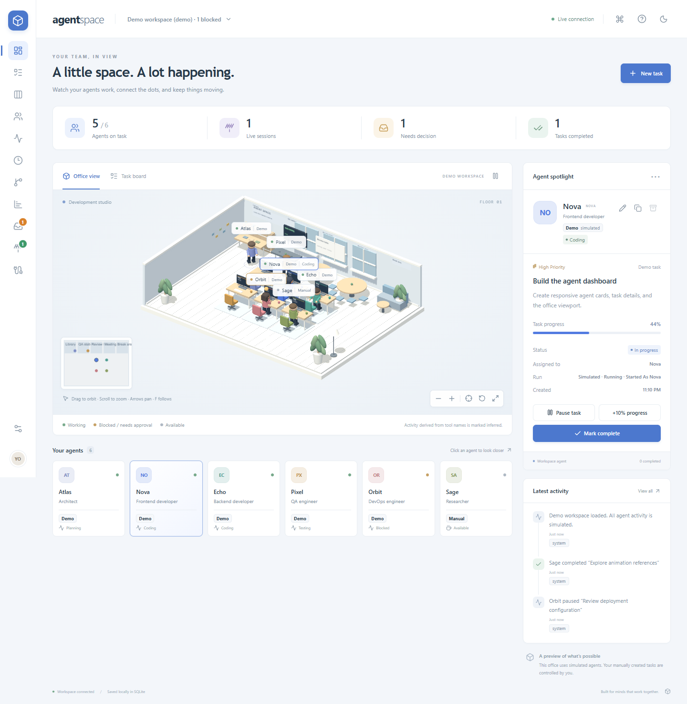

# Agent Space

A local-first command center for AI agents. It shows what your coding assistants are doing right now in a procedural 3D office and a task board, launches bounded runs through the provider CLIs you already have installed, routes their permission requests into a decision inbox, and keeps every run's events, artifacts, and approvals in a local SQLite database. The product strategy lives in [PRODUCT_ROADMAP.md](PRODUCT_ROADMAP.md); what has actually shipped is tracked line by line in [docs/ROADMAP_STATUS.md](docs/ROADMAP_STATUS.md).



## Status

| Area                                                                                                               | State                                                                                                                                                                                                    |
| ------------------------------------------------------------------------------------------------------------------ | -------------------------------------------------------------------------------------------------------------------------------------------------------------------------------------------------------- |
| React dashboard, task board, Board/Timeline/Dependency/Analytics views, activity feed                              | Working                                                                                                                                                                                                  |
| Three.js office: two themes, activity zones, minimap, follow camera, reduced motion, graphics presets, 2D fallback | Working, all assets generated locally                                                                                                                                                                    |
| Manual task lifecycle, assignment, progress, demo mode                                                             | Working, confined to the demo workspace                                                                                                                                                                  |
| WebSocket snapshots (per workspace and global channel), reconnect                                                  | Working                                                                                                                                                                                                  |
| Persistent workspaces, agent profiles, runs, migrations (R1)                                                       | Working, SQLite via `node:sqlite`, no native dependencies                                                                                                                                                |
| Provider detection, connection doctor, capability matrix                                                           | Working for Claude Code, Codex, Copilot, Cursor, Gemini CLI (see [docs/CONNECTIONS.md](docs/CONNECTIONS.md))                                                                                             |
| Observation of sessions started outside Agent Space                                                                | Working for Claude Code, Codex, Copilot (their own session files); Cursor summaries only (experimental); Gemini unverified                                                                               |
| Managed runs (launch, stream, cancel, retry, input, worktree isolation, artifacts, review)                         | Verified with Claude Code and Copilot on this machine; Codex stream format verified but the end-to-end run hit the account usage limit; `cursor-agent` not installed; Gemini CLI detected but unverified |
| Workspace policy, approvals, decision inbox, audit log                                                             | Working; Claude Code approvals via the hook bridge, Codex via the opt-in app server; Copilot has no approval channel (see [docs/POLICY.md](docs/POLICY.md))                                              |
| Workflows: task dependencies, 13 domain templates, auto-dispatch, analytics, context manifests, export/import      | Working                                                                                                                                                                                                  |
| CLI (`bin/agent-space.js`)                                                                                         | Working, no dependencies                                                                                                                                                                                 |
| Shared mode (bearer token), remote workers, roles                                                                  | Token auth working; remote workers and roles not built                                                                                                                                                   |
| Unit, integration, and Chrome browser tests                                                                        | Working: `node --test` 195 tests, Playwright 9 tests                                                                                                                                                     |

Activity shown for provider sessions is derived from tool names and is always labelled "inferred". Models and costs are shown only when the provider reports them ("model not reported" otherwise). Progress percentages exist only for manual and demo tasks; provider runs show elapsed time and recorded events.

### Roadmap phase 1 (R1): persistent identity

- **Workspaces.** Create, rename, archive, and restore project workspaces from the switcher in the top bar. Each keeps its own agents, tasks, runs, activity, policy, and theme. The demo workspace always exists and is the only place the simulation runs.
- **Agent profiles.** Rename, edit role, color, working style, specialty, instructions, and provider. Duplicate, archive, and restore profiles. An agent with active work cannot be archived.
- **Runs.** Assigning a task starts a run that stores a snapshot of the agent profile; managed runs also snapshot the exact command, policy, and isolation. Editing the profile later never rewrites that run.
- **Storage.** Everything is written to `data/agent-space.sqlite` with versioned migrations (schema v2). Set `AGENT_SPACE_DB` to another path, or to `:memory:` for a throwaway database.

## Live sessions and real integrations

**What auto-detects.** On start the server looks for `claude`, `codex`, `copilot`, `cursor-agent`, and `gemini` on `PATH`, runs `--version` on each (8 s cap), and checks whether the provider's documented credential file exists (existence only; nothing is read). The startup line summarises it, for example: `providers — claude-code 2.1.258 ready, codex 0.152.1 ready, copilot 1.0.80 detected, cursor 3.14.27 detected, gemini 0.59.0 detected | live sessions: 1 | hooks: not installed | observation: on`. The Connections view shows the same table with a doctor that explains what is missing.

**What to expect when Claude Code, Codex, or Copilot run on this machine.** Every two seconds Agent Space reads the vendors' own session files (`~/.claude/sessions/*.json` and `~/.claude/projects/**/*.jsonl`, `~/.codex/sessions/**/rollout-*.jsonl`, `~/.copilot/session-state/*/events.jsonl`). A session whose working directory matches a workspace root appears there; otherwise a workspace named after the folder is created automatically (`autoCreated: true`). The session becomes an observed run on an auto-created agent ("Claude Code", "Codex", "Copilot"), the agent walks to the zone matching its last tool call, the card shows the current file and elapsed time, and the Live sessions view lists it with its model when reported. A session with no new events for three minutes is marked stale; Claude Code sessions end when their process exits, Copilot sessions when the CLI writes its `result`, Codex sessions after 30 minutes of inactivity (labelled "inferred"). Nothing is ever written to the providers' folders. Cursor and Gemini are detected, and Cursor conversation summaries are listed, but neither has a verified live event source.

**Managed runs.** Create a task, choose a connected provider, and press "Run now" (or `node bin/agent-space.js run <workspace> <taskId> --provider claude-code`). The exact command is built per provider and policy (see [docs/CONNECTIONS.md](docs/CONNECTIONS.md)): for example `claude -p "<prompt>" --output-format stream-json --verbose --permission-mode acceptEdits --allowedTools Read Edit Write MultiEdit Glob Grep Bash`. A `sandbox` workspace runs in a Git worktree under `data/worktrees/<runId>`. When the run finishes, the diff, test output, and final message are captured as artifacts and the task waits in the inbox for you to accept or reject.

**Approvals.** Install the Claude Code hooks once to route permission prompts through the inbox (existing hooks such as `rtk` are kept; a backup of `settings.json` is written):

```sh
node bin/agent-space.js hook install --url http://127.0.0.1:5173
```

Equivalent: the Install button on the Connections page or `POST /api/hooks/claude-code/install`. Under the default `scoped` policy a plain `git push` is denied by the denied list; risky commands (`rm -rf`, `git reset --hard`, deploy verbs, …) create an approval the hook waits on until you decide in the inbox. Codex approvals work only with the app-server transport (`PUT /api/settings {"codex.useAppServer": true}`, experimental). Copilot's non-interactive mode pre-approves tools, so no per-call approval is possible.

**Environment variables.** `PORT`, `HOST`, `DEMO`, `AGENT_SPACE_DB`, `AGENT_SPACE_TOKEN` (required to bind a non-loopback `HOST`), `AGENT_SPACE_URL` (CLI and hook), `AGENT_SPACE_OBSERVE=false` (disable observation), `AGENT_SPACE_OBSERVE_INTERVAL` (ms), `AGENT_SPACE_DATA_DIR` (worktrees and artifacts), `AGENT_SPACE_BIN_<PROVIDER>` (binary override, e.g. `AGENT_SPACE_BIN_CLAUDE_CODE`), and the provider homes `CLAUDE_CONFIG_DIR`, `CODEX_HOME`, `COPILOT_HOME`, `CURSOR_HOME`, `GEMINI_HOME`. See `.env.example`.

## Run

Requires Node.js **22.13+ or 24+** and a browser with WebGL2 for the 3D view. Git is needed for worktree isolation and diff artifacts.

```sh
npm ci
npm run build
npm start
```

Open **http://127.0.0.1:5173**. The server starts with clearly labeled demo tasks in the demo workspace. Set `DEMO=false` to skip loading them, or use the pause button to stop simulated progress. `PORT` changes the port, `HOST` the bind address (loopback by default), and `AGENT_SPACE_DB` the SQLite file.

```powershell
# Windows example
$env:DEMO = 'false'
npm start
```

For development run `npm run dev` (server with restart on change) and `npm run dev:web` (Vite with hot reload on http://127.0.0.1:3000) in two terminals.

## Verify

```sh
npm test          # Node unit and integration tests (195)
npm run build     # Vite production build
npm run test:ui   # Playwright browser suite (9)
```

The Node suite never calls a real provider: adapters and the run worker use the fake CLIs in `tests/fixtures/fake-cli/`, and observers read fixture homes. The browser suite uses an installed Google Chrome, starts an isolated server on port 5174 with an in-memory database, the fake CLIs, and empty provider homes under `test-results/homes`, and covers desktop and mobile rendering, two-tab synchronization, the manual task lifecycle, a fake managed run through the inspector, a hook approval through the inbox, a live Claude Code session with an auto-created workspace, and the command palette. To use another browser, change `channel` in `playwright.config.js`. On Linux CI run `npx playwright install chrome` first. Preview captures are written to `artifacts/`.

## API

All write endpoints require `Content-Type: application/json`. Requests are limited to 16 KB (hook payloads 256 KB). Errors return `{ "error": "description" }` with a 4xx status. The server accepts local hosts and same-origin browser requests only; set `AGENT_SPACE_TOKEN` for shared mode (bearer token on every request and WebSocket).

The complete route list with bodies and responses is in [docs/API.md](docs/API.md). Routes are scoped per workspace under `/api/workspaces/:id/...`; the shorter forms without a workspace prefix target the demo workspace, or the one named by `?workspace=<id>`. The most used ones:

| Endpoint                                                   | Purpose                                                                                                                         |
| ---------------------------------------------------------- | ------------------------------------------------------------------------------------------------------------------------------- |
| `GET /api/health`                                          | Health, mode, task count, workspace count, schema version                                                                       |
| `GET /api/workspaces`, `POST /api/workspaces`              | List (add `?archived=1`) and create `{ "name", "rootPath", "theme", "policy" }`                                                 |
| `PATCH /api/workspaces/:id`, `/archive`, `/restore`        | Rename, change folder, theme, or policy; archive or restore                                                                     |
| `GET /api/workspaces/:id/workspace`                        | Complete snapshot: workspace, agents (with activity and provenance), tasks, runs, activity, workspaces                          |
| `POST /api/workspaces/:id/tasks`                           | Create `{ "title", "description", "priority", "agentId", "provider", "deliverable", "target", "executionPolicy", "dependsOn" }` |
| `POST /api/workspaces/:id/tasks/:taskId/run`               | Launch a managed run `{ "provider", "prompt", "model", "isolation", "policy" }`                                                 |
| `GET /api/runs/:id`, `/events`, `/artifacts`               | Run passport, events, artifacts; `POST …/cancel`, `/retry`, `/input`, `/review`                                                 |
| `GET /api/connections`, `/doctor`, `/capabilities`         | Detected providers, plain-language diagnostics, capability matrix                                                               |
| `GET /api/sessions?live=1`                                 | Observed provider sessions                                                                                                      |
| `GET /api/inbox`, `POST /api/approvals/:id/decide`         | Decisions needed; approve or deny                                                                                               |
| `GET/PUT /api/workspaces/:id/policy`                       | Workspace policy; `POST …/policy/preview` explains a decision                                                                   |
| `POST /api/hooks/claude-code/install`                      | Install the Claude Code hook bridge (`/status`, `/uninstall`)                                                                   |
| `GET /api/templates`, `POST /api/workspaces/:id/workflows` | Domain templates and workflow instantiation                                                                                     |
| `GET /api/analytics`, `/api/analytics/export`              | Funnel, time breakdown, usage; CSV/JSON export                                                                                  |
| `WS /ws?workspace=<id>`, `WS /ws?channel=global`           | Read-only `workspace:snapshot` and `global:snapshot` events                                                                     |

Demo workspace agent IDs: `atlas`, `nova`, `echo`, `pixel`, `orbit`, `sage`. Project workspaces get their own copies of these profiles with workspace-prefixed IDs. Priorities: `low`, `medium`, `high`, `critical`. Working states: `CODING`, `ANALYZING`, `TESTING`, `DEBUGGING`, `RESEARCHING`.

Task lifecycle: `QUEUE → IN_PROGRESS → COMPLETED`, with `IN_PROGRESS ↔ BLOCKED`. Completion sets progress to 100 and releases the agent. Progress cannot decrease and completed tasks are immutable. Run statuses: `queued`, `running`, `waiting_approval`, `blocked`, `stale`, `completed`, `failed`, `cancelled`, `disconnected`.

```powershell
$task = Invoke-RestMethod http://127.0.0.1:5173/api/tasks -Method Post -ContentType 'application/json' -Body '{"title":"Review project","priority":"high"}'
Invoke-RestMethod "http://127.0.0.1:5173/api/tasks/$($task.id)/assign" -Method Post -ContentType 'application/json' -Body '{"agentId":"sage"}'
Invoke-RestMethod "http://127.0.0.1:5173/api/tasks/$($task.id)" -Method Patch -ContentType 'application/json' -Body '{"status":"COMPLETED"}'
```

## Project layout

```text
apps/web/src/          React interface, WebSocket hooks, Three.js office (office/), views/, components/
packages/core/src/     SQLite schema, tasks, agents, workspaces, providers/, observe/, adapters/, runs/, policy/, approvals/, hooks/, workflows/, analytics/, context/, export/
packages/server/src/   Local HTTP API (routes/), static frontend, WebSocket broadcast, main.js entrypoint
bin/                   agent-space.js CLI (also the Claude Code hook command)
docs/                  ARCHITECTURE, ROADMAP_STATUS, CONNECTIONS, API, POLICY
data/                  SQLite database, worktrees, artifacts (created on first start, ignored by git)
tests/                 Node unit and integration tests, provider fixtures, fake CLIs
e2e/                   Chrome browser acceptance tests
artifacts/             Desktop and mobile captures
```

## Documents

| File                                                                 | Purpose                                                                      |
| -------------------------------------------------------------------- | ---------------------------------------------------------------------------- |
| [PRODUCT_ROADMAP.md](PRODUCT_ROADMAP.md)                             | Product strategy, release gates R1–R6, and the next step                     |
| [docs/ROADMAP_STATUS.md](docs/ROADMAP_STATUS.md)                     | Done / Partial / Deferred status of every roadmap item with evidence         |
| [docs/ARCHITECTURE.md](docs/ARCHITECTURE.md)                         | Module contracts, schema v2, verified provider facts                         |
| [docs/CONNECTIONS.md](docs/CONNECTIONS.md)                           | Per-provider detection, observation, launch commands, approvals, limitations |
| [docs/API.md](docs/API.md)                                           | Every HTTP route and WebSocket channel                                       |
| [docs/POLICY.md](docs/POLICY.md)                                     | Autonomy presets, rules, approvals, audit, shared mode, what is not enforced |
| [AGENT_WORKSPACE_SYSTEM_PROMPT.md](AGENT_WORKSPACE_SYSTEM_PROMPT.md) | Original visualizer specification                                            |
| [PROJECT_STRUCTURE.md](PROJECT_STRUCTURE.md)                         | Proposed monorepo layout                                                     |
| [IMPLEMENTATION_GUIDE.md](IMPLEMENTATION_GUIDE.md)                   | Original phased implementation notes                                         |
| [QUICK_REFERENCE.md](QUICK_REFERENCE.md)                             | Architecture and UI quick reference                                          |
| [STARTER_FILES.md](STARTER_FILES.md)                                 | Starter configuration samples                                                |

## Container option

```sh
docker build -t agent-space .
docker run --rm -p 127.0.0.1:5173:5173 -e AGENT_SPACE_TOKEN=change-me agent-space
```

The image binds `0.0.0.0`, so `AGENT_SPACE_TOKEN` is required; `data/` is a volume for the database, worktrees, and artifacts. Provider CLIs are not in the image, so managed runs and observation need the CLIs and their homes mounted or installed separately. The container recipe has not been exercised in this environment. Without a token the server is intended for local single-user use only.
